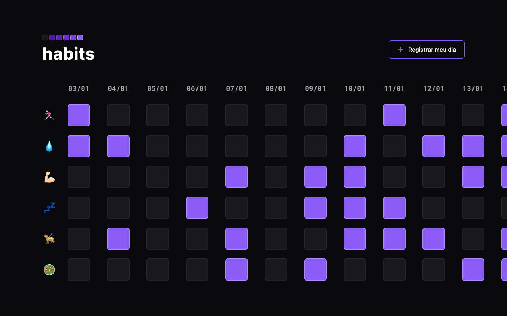

<h1 align="center"> Habits Tracker </h1>

NLW é um evento exclusivo e gratuito, promovido pela Rocketseat para ensino de tecnologias e conceitos em desenvolvimento Web.  

  <a href="#-tecnologias">Tecnologias</a>&nbsp;&nbsp;&nbsp;|&nbsp;&nbsp;&nbsp;
  <a href="#-projeto">Projeto</a>&nbsp;&nbsp;&nbsp;|&nbsp;&nbsp;&nbsp;
  <a href="#-layout">Layout</a>&nbsp;&nbsp;&nbsp;

 

  

## 🚀 Tecnologias

Esse projeto foi desenvolvido com as seguintes tecnologias:

- HTML e CSS
- JavaScript
- Git e Github
- Figma

## 💻 Projeto

O Habits Tracker é um aplicativo com o objetivo de ajudar as pessoas a acompanhar seu progresso e realização de hábitos pessoais.

- [Visite o projeto online](https://LokullTZ.github.io/NLWSetup_habits)

## 🔖 Layout

Você pode visualizar o layout do projeto através [DESSE LINK](https://www.figma.com/community/file/1195327109778210238). É necessário ter conta no [Figma](https://figma.com) para acessá-lo.

---

Ideia e Desenvolvimento: Com ♥ by Rocketseat  
Replicado por: Leonardo Ribeiro de Oliveira.

:wave: [Participe da nossa comunidade!](https://discord.gg/rocketseat)